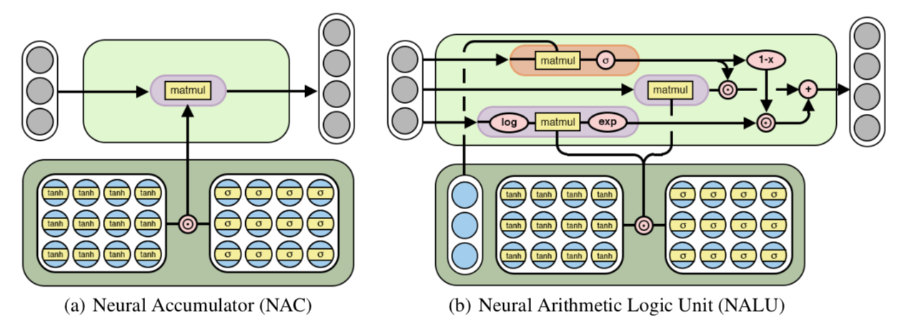

# Classes Project

## Remote Sensing Project - Fall 2018
Application of Multi-Layer Perceptron with Neural Arithmetic Logic Units (NALU) on Remote Sensing Data 
-> Specifically on Indian Pines

Google Collab: https://colab.research.google.com/drive/1yHmOH3p7-VodnKPw3GNkToW_dCrkgWU9

Original Paper: https://arxiv.org/pdf/1808.00508.pdf

Original Implementation:https://github.com/kevinzakka/NALU-pytorch

 

## License

This project is licensed under the MIT License - see the [LICENSE.md](LICENSE.md) file for details

